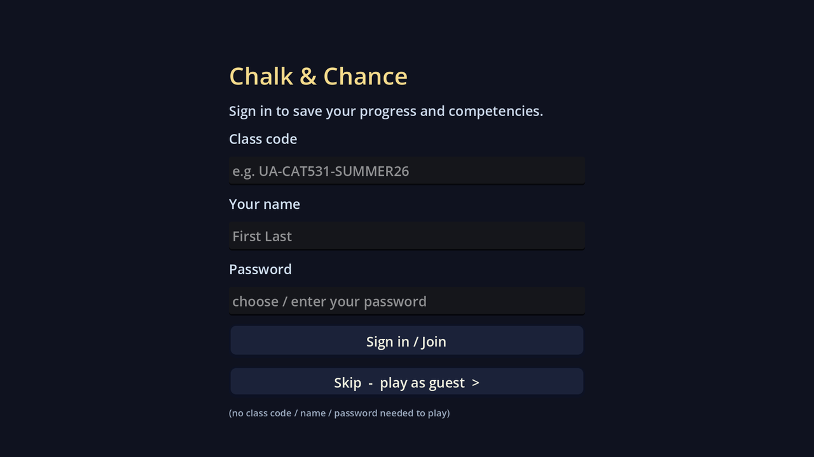
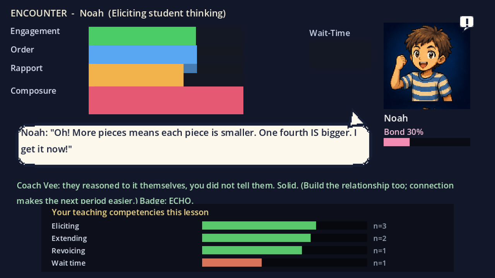
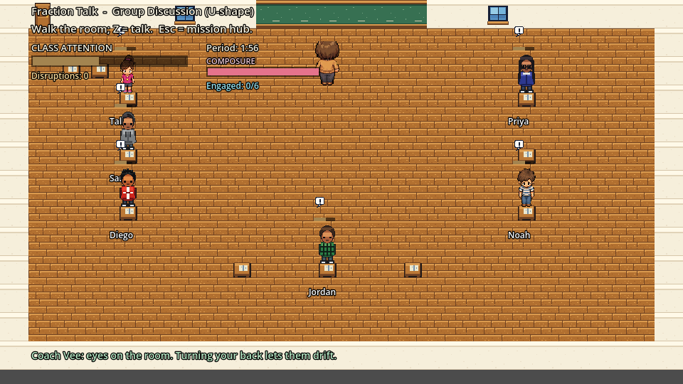
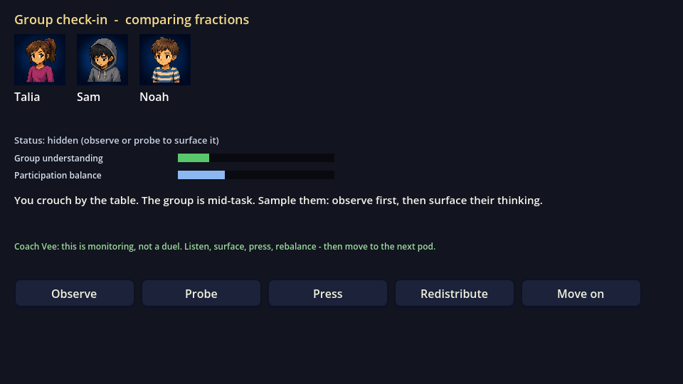
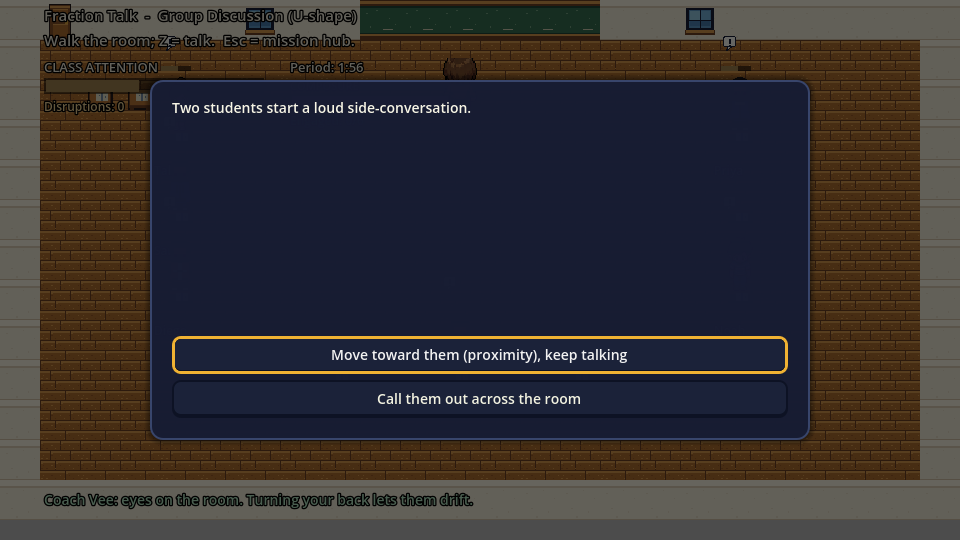

<div align="center">

# 🎓 Chalk & Chance

### A Pokémon-style teacher-simulation for deliberate mental rehearsal

*Walk a top-down classroom, manage a living room of LLM-style students, and surface their
thinking move by move. Every mechanic is grounded in high-impact education research.*

[**▶ Play in your browser**](https://educatian.github.io/chalk-and-chance-play/) &nbsp;•&nbsp;
[**🌐 Landing page**](https://chalk-and-chance.pages.dev) &nbsp;•&nbsp; Built in **Godot 4.6.3**

</div>

---

## What it is

Chalk & Chance is a teacher-preparation **mental-rehearsal** tool disguised as a cozy
pixel game. You play a first-year teacher: every classroom door is a high-leverage practice,
every "battle" is a read–act–observe dialogue against a student who holds a frozen
misconception and won't simply agree with you. You win by *surfacing reasoning*, not lecturing.
It's also a research artifact — each mechanic is anchored to the literature it trains.

## Screenshots

**New: live LLM students, your own dialogue, and a competency read-out.**

| Sign in (or skip and play as guest) | One-on-one encounter (LLM student + adaptive coach) |
|---|---|
|  |  |

| Type your own words (an LLM judge reads the move) | Your teaching competencies, estimated live |
|---|---|
|  |  |

| Mission hub (badge-gated campaign) | Lecture mode (reactive students) |
|---|---|
|  |  |

| Group discussion (U-shape) | One-on-one encounter |
|---|---|
|  |  |

| Gym boss (manage 4 at once) | Group work (clusters) |
|---|---|
|  |  |

| Interrupt event (triage) | Scored debrief |
|---|---|
|  |  |

| Import your own lesson plan | Review & adjust before playing |
|---|---|
|  |  |

## Core ideas

- **Decomposed practice.** One classroom = one high-leverage practice (Grossman; TeachingWorks).
- **Live classroom management.** Attention drifts when you're far away or facing the board;
  proximity and scanning are real moves (Kounin's *withitness*). A period clock runs, and
  interruptions (intercom, a knock, a late student) must be triaged.
- **Differentiated students.** 10 research-grounded personas, each resolved by the move that
  actually works for them (e.g., Deshawn = least-intrusive redirect; Mei-Lin = process feedback;
  Marcus = affect-first de-escalation; Sam = warm call + wait time).
- **Seating by task.** Discussion uses a U-shape, lecture uses rows, group work uses clusters,
  because the evidence says the task should dictate the arrangement (Wannarka & Ruhl 2008).
- **Lecture mode.** Direct instruction as a rhythm: Present vs Check-for-Understanding, with an
  attention curve and equitable cold-calling (Rosenshine; Lemov; Marx et al.).
- **Scored debrief + badges.** Each period is coached and scored against named objectives;
  gym-badge progression unlocks the next missions.
- **Import a lesson plan.** Paste or upload your plan and the game builds a customized scenario
  (seating, objectives, and student dialogue tuned to your content).

## Evidence base (selected, OpenAlex-verified counts)

| In-game | Anchor | Cites |
|---|---|---|
| Process-focused feedback | Hattie & Timperley, *The Power of Feedback* (2007) | ~11,900 |
| Re-engaging the withdrawn | Fredricks, Blumenfeld & Paris, *School Engagement* (2004) | ~11,600 |
| Diagnosis / professional noticing | Jacobs, Lamb & Philipp (2010) | ~1,300 |
| Least-to-most redirect | Simonsen et al., *Evidence-based Classroom Management* (2008) | ~900 |
| Wait-time ring | Rowe (1986); seating by task: Wannarka & Ruhl (2008), Marx et al. (1999) | canonical |

Full design + evidence docs live in this repo: `GAME_CONCEPT.md`, `PERSONAS_EVIDENCE.md`,
`SEATING_ARRANGEMENTS.md`, `ENVIRONMENT_MECHANICS.md`, `LECTURE_DESIGN.md`,
`SCENES_AND_MISSIONS.md`, `LESSON_PLAN_IMPORT.md`, `QUALITATIVE_RESEARCH_AUDIT.md`,
`GAME_ROADMAP.md`.

## How to play

- **Arrow keys** move; **Z / Enter** talk to a student; **Esc** returns to the mission hub.
- In an encounter, pick a teaching move; surface the student's reasoning (Elicit / Extend /
  Revoice / Wait) rather than telling. Hold ~3s before acting for the wait-time bonus.
- Finish a lesson meeting its objectives to earn its badge and unlock the next missions.

## Run from source

Open the project in **Godot 4.6.3** and press play, or:

```
godot --path .            # play
godot --headless --export-release "Web" dist_web/index.html   # web build (needs export templates)
```

Web build is single-threaded (no cross-origin headers needed); it uses an in-engine stubbed
student model by default. A FastAPI backend (`tools/llm_backend/`) adds content-specific
dialogue via a local or cloud LLM.

## Project layout

```
scenes/      Main, overworld (Overworld, Player), encounter (Encounter, GymEncounter, LectureScene), ui (Hub, ImportLesson, PreviewScenario)
scripts/     Art, Seating, LessonImport
autoload/    GameState, Game, SceneRouter, LLMClient
data/        scenarios/*.json (one file per mission), persona_library/*.json (the 10 students)
assets/      pixel sprites, portraits, tiles, ui   ·   ui/ theme + font
landing/     marketing landing page (deployed to Cloudflare Pages)
tools/       llm_backend (FastAPI), converter prompts, dev screenshots
```

## Status

Concept + playable vertical slices across discussion / lecture / group work / independent /
gym, with a badge-gated campaign and lesson-plan import. A teacher-preparation rehearsal tool
and a research artifact, in active development.

<div align="center"><sub>🤖 built with Claude Code · pixel art generated with Codex imagegen2</sub></div>
