# Chalk & Chance

**A Godot teacher-simulation game for evidence-grounded classroom rehearsal.**

Chalk & Chance is a pixel-art teacher-preparation game where the player rehearses high-leverage teaching moves in a living classroom. It is not a simple chat tree: the player navigates the room, chooses who needs attention, manages composure and order, uses classroom tools, and receives construct-level evidence about their teaching moves.

[Demo gate](https://chalk-and-chance.pages.dev/demo.html) | [Project page](https://chalk-and-chance.pages.dev) | Built with Godot 4.6.3

## Current Build

The current build includes:

- Mission hub with badge-gated scenarios, adaptive practice recommendation, level progress, upgrades, item loadout, and local leaderboard.
- Mission briefing before play, with generated classroom backdrop, story hook, success criteria, reward, evidence edge, and first-move guidance.
- Multiple classroom formats: discussion, lecture, group work, independent work, one-on-one encounter, and gym capstone.
- Free-text teacher talk: players can type their own line and the game maps it to a teaching move.
- Explicit debrief panels across encounter, lecture, gym, group check-in, and overworld lessons, with score drivers, next focus, rewards, and Continue/replay actions.
- Evidence Journal: live ECD/Elo-style competency estimates, evidence counts, uncertainty, research anchors, recent run evidence, and a practice target for the next high-leverage move.
- Level-up, badge rewards, item rewards, upgrade points, and leaderboard records.
- Lesson-plan import: paste or load a lesson plan and generate a playable scenario.
- Product QA gates for UI clipping/overlap, visual assets, scenario integrity, telemetry, and playable learning loops.
- Public web demo access opens an API-safe offline taste mode; paid AI voice stays off unless opened through the server-verified passcode gate.

## Screenshots

| Mission hub | Mission briefing |
|---|---|
| 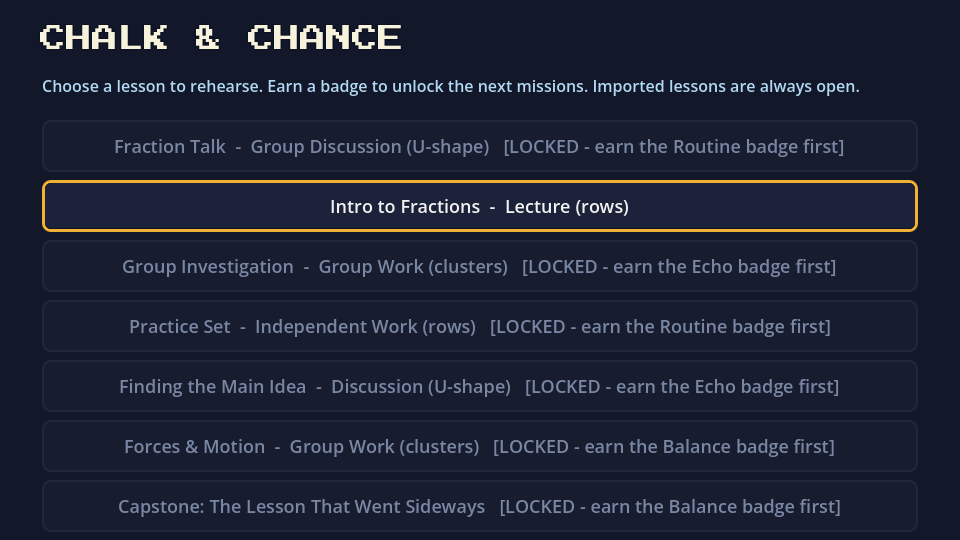 | 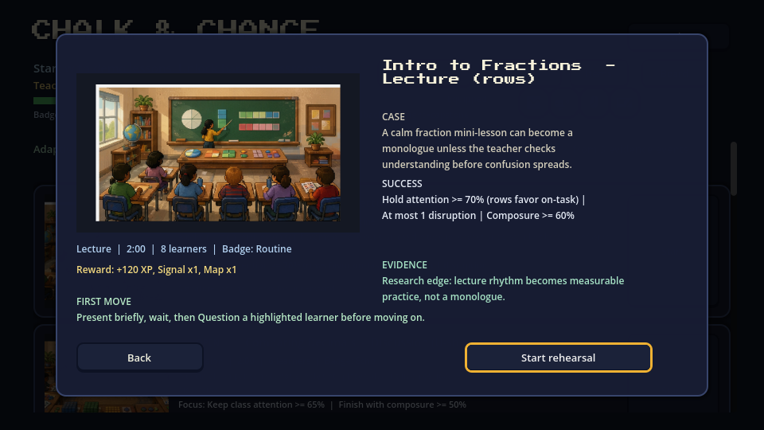 |

| One-on-one encounter | Type your own teacher talk |
|---|---|
| 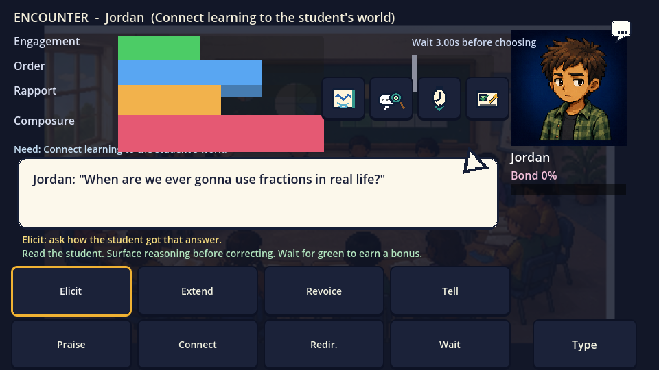 | 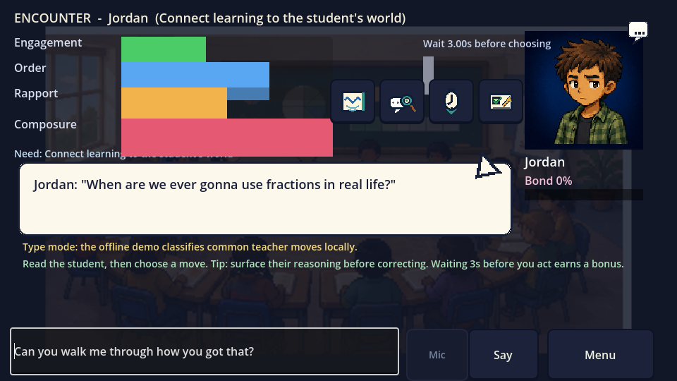 |

| Evidence Journal | Item loadout |
|---|---|
| 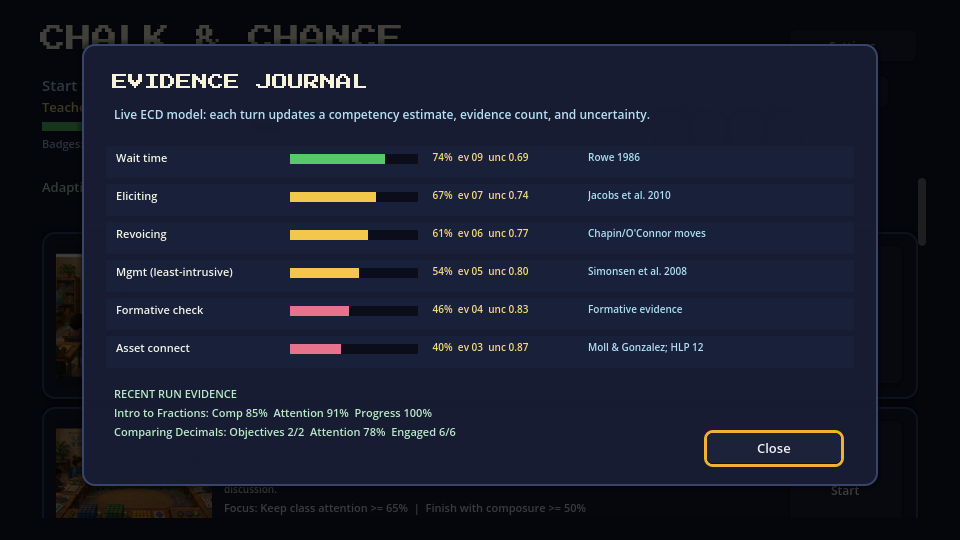 | 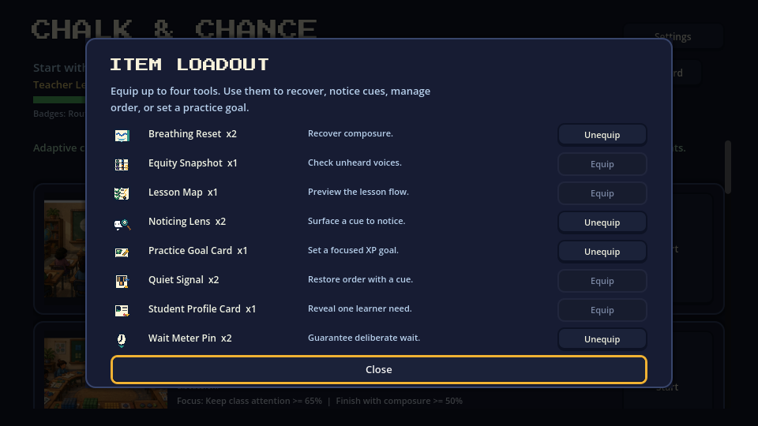 |

| Lecture mode | Gym capstone |
|---|---|
| 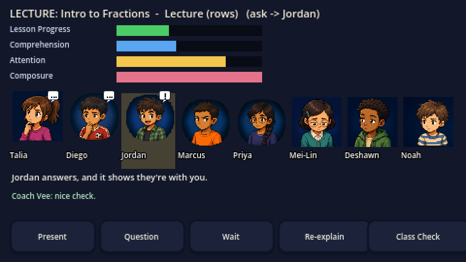 | 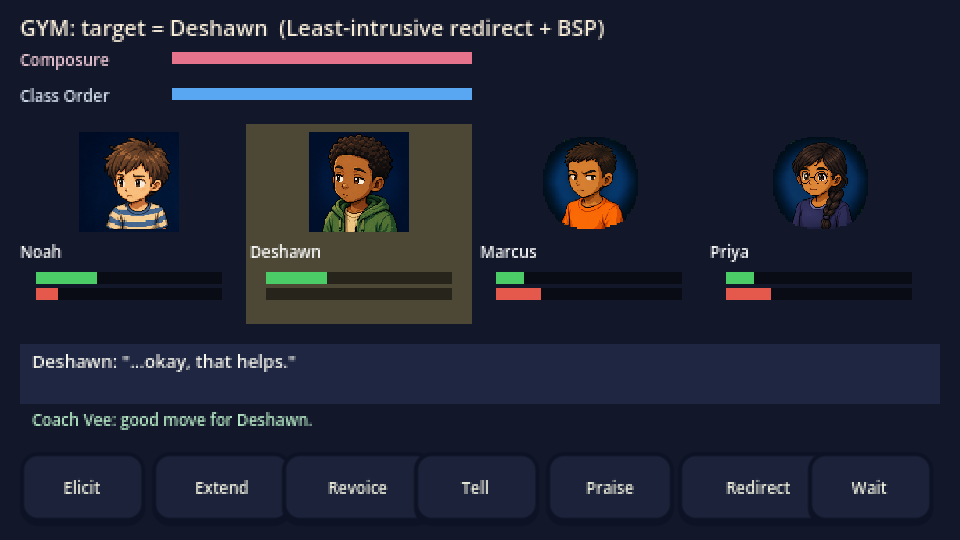 |

| Reflection prompt | Lesson debrief |
|---|---|
| 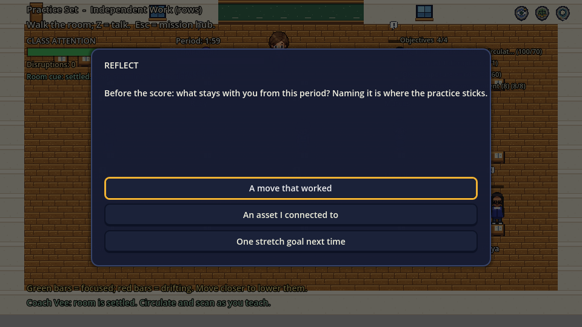 | 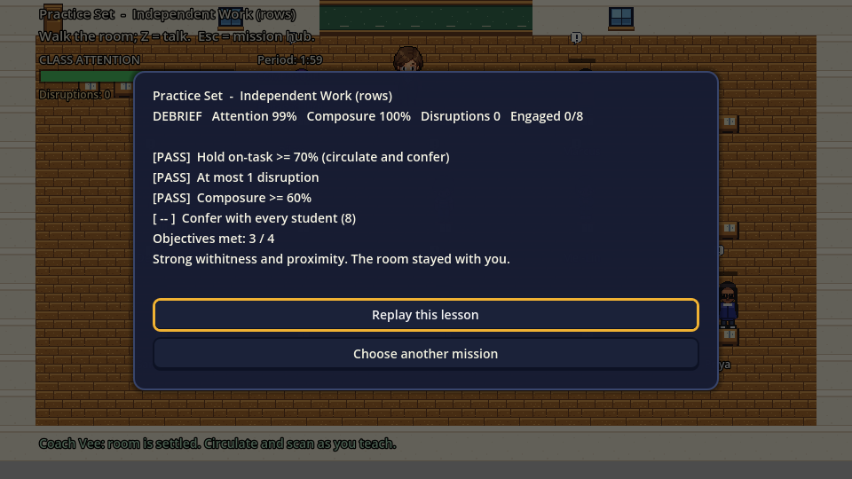 |

| Group check-in debrief | Leaderboard |
|---|---|
| 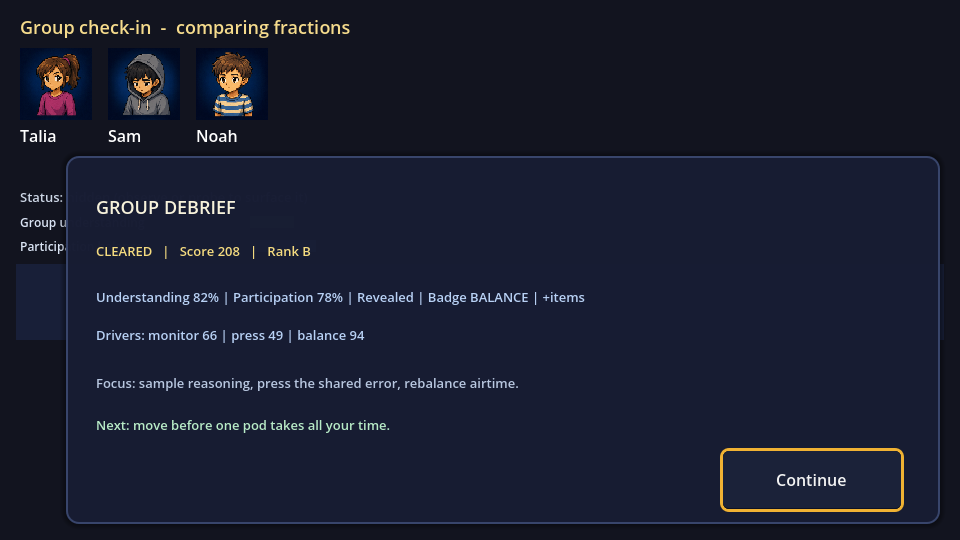 | 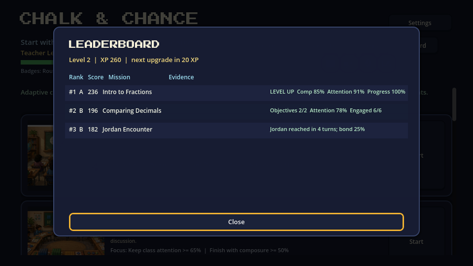 |

| Lesson import | Review generated scenario |
|---|---|
| 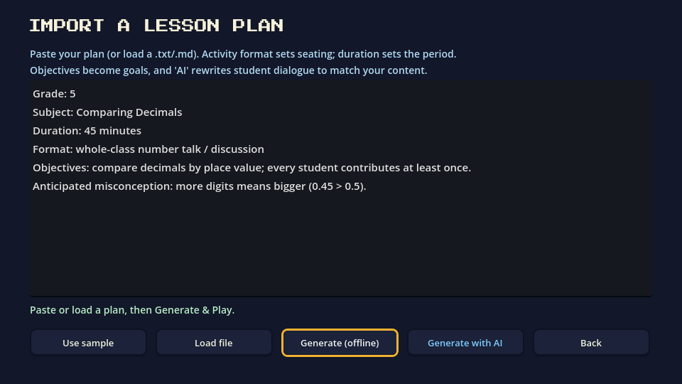 | 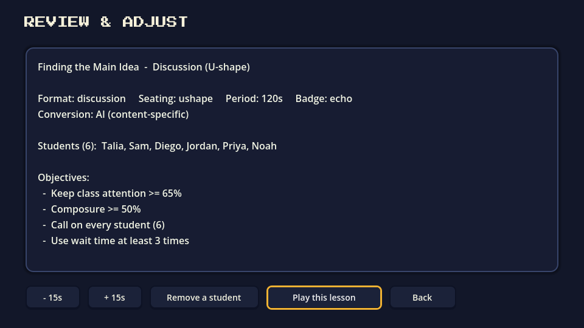 |

| Evidence Journal | Full UI montage |
|---|---|
|  | 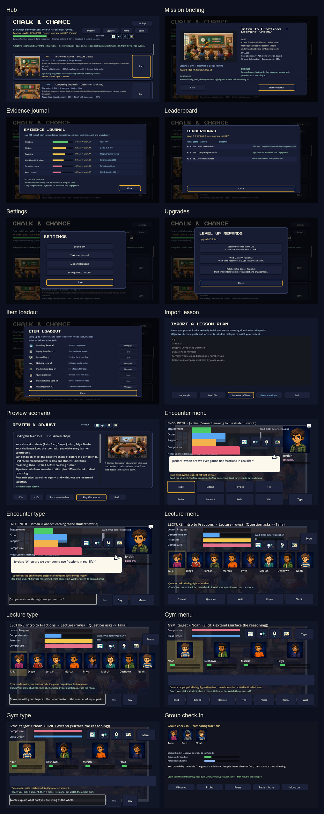 |

## What Makes It Different

Chalk & Chance is designed as a teacher rehearsal system rather than an avatar-only conversation demo.

- **Classroom orchestration:** movement, proximity, attention drift, interruptions, composure, and order all matter.
- **Differentiated learners:** each persona has a distinct need and responds to different moves.
- **Construct-level evidence:** every move can update competency estimates such as eliciting reasoning, wait time, revoicing, least-intrusive management, formative checking, group monitoring, and status treatment.
- **Scenario-backed progression:** badges unlock harder missions, rewards grant classroom tools, and the leaderboard records run quality.
- **Content adaptability:** lesson import converts a teacher's own plan into scenario data, objectives, roster, and dialogue hooks.

## Evidence-Grounded Mechanics

| In game | Construct | Evidence anchor |
|---|---|---|
| Wait-time readiness | Productive pause after a prompt | Rowe 1986 |
| Elicit / Extend / Revoice | Student reasoning and discourse moves | Jacobs, Lamb & Philipp 2010; Chapin/O'Connor discourse moves |
| Least-intrusive redirect | Behavior management without escalation | Simonsen et al. 2008 |
| Specific praise | Behavior-specific feedback | Reinke, Lewis-Palmer & Merrell 2008 |
| Asset connect | Funds-of-knowledge connection | Moll & Gonzalez; TeachingWorks HLP 12 |
| Group monitoring | Withitness and monitoring | Kounin withitness / classroom monitoring |
| Formative check | Check for understanding | Black & Wiliam 1998 |
| Status treatment | Equitable participation in group work | Cohen & Lotan complex instruction |

The runtime competency model is documented in `data/competency_model.json` and displayed in the in-game Evidence Journal.

## Product QA

Run the full product gate from the repository root:

```powershell
powershell -NoProfile -ExecutionPolicy Bypass -File .\scripts\run_product_qa.ps1
```

Current gates include:

- Project load
- UI layout audit in normal and large-text modes, including text clipping, interactive overlap, button text fit, and dialogue-box padding
- Visual asset audit for backdrops, icons, portraits, and sprite distortion
- Learning surface content audit for adaptive coaching, practice targets, research edge, unlock guidance, and leaderboard evidence
- Landing/social metadata audit for Open Graph, Twitter cards, favicon assets, and 1200x630 share image quality
- API cost gate audit for public-demo offline mode, server-verified voice-token access, and TTS token validation before ElevenLabs calls
- Scenario/data integrity audit for mission fields, objectives, badges, roster links, backdrops, persona overrides, and competency-model coverage
- Encounter smoke test and differentiated persona behavior
- Lecture mode, gym capstone, lesson import, telemetry/xAPI, and overworld ecology
- Screenshot refresh plus quality validation for the main product surfaces, including completion panels, reflection prompts, and overworld debrief

The latest report is written to `tools/product_qa_report.txt`.

## Run From Source

Open the project in Godot 4.6.3 and press Play, or run:

```powershell
C:\Users\jewoo\godot\godot.exe --path .
```

For a web export:

```powershell
godot --headless --export-release "Web" dist_web/index.html
```

The game runs offline with an in-engine student model. Optional backend services in `tools/llm_backend/` and `cloudflare/` can support LLM-driven dialogue and content-specific turns.

## Project Layout

```text
autoload/    GameState, Game, Competency, Items, Telemetry, LLM/TTS/voice clients
assets/      portraits, item icons, classroom backdrops, pixel UI assets
data/        scenarios, persona library, competency model, scenario schema
docs/        screenshots, comparison notes, productization QA
landing/     project page and player guidebook assets
scenes/      hub, login, import, preview, overworld, encounter, lecture, gym, dev tests
scripts/     art loading, lesson import, pixel UI scaling, QA runner
tools/       generated screenshots, QA report, backend helpers
```

## Status

Playable vertical slice with campaign progression, scenario backdrops, mission briefing, explicit debriefs, level-up/leaderboard loop, item loadout, evidence journal, lesson import, and product QA gates. Active development continues toward a polished educational game and research-grade teacher simulation.
